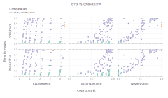
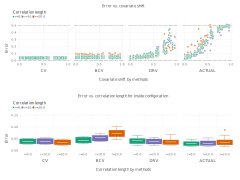

# Overview

This repository contains the experiments of the paper
*Hoffimann et. al. 2020. Generalization error of learning
models under covariate shift and spatial correlation*.

# Instructions

After cloning the repository, you can either run the scripts
to reproduce the results in your machine, or plot the results
that were saved in the repository by the authors.

Please make sure that you have Julia v1.4 or a newer version of the language installed.

## Running

From the root folder of the project:

```bash
# Gaussian experiment
shell> julia --project gaussian.jl

# New Zealand experiment
shell> julia --project newzeand.jl
```

## Plotting

Run the same commands but from the `results` folder.

## Results

### Gaussian





### New Zealand

TODO
